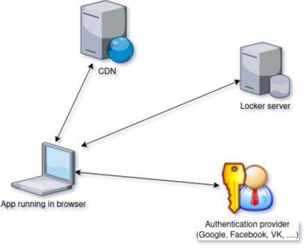

# Locker application architecture

## Entities

- CDN: server which serves files for your website/application. This could be localhost or usual server with apache or nginx or `locker-admin serve` on localhost. Or CDN (surge.sh, netlify, cloudflare pages, github pages, gitlab pages, ...). All of them allows hosting static content for free.
- Locker server. Your (free) virtual server on locker with hostname in your domain or in www-security.net domain.
- Authentication provider: Google, Facebook, VK, anything with OpenID Connect support.

## Workflow
- User goes to your website example.com and downloads content (html, js, images) from CDN
- Your JS app asks Locker server and if user is not authenticated, it redirects user to authentication provider
- When user authenticated, app can read/write files from user's personal locker, e.g. notes, shopping history, invoices, etc.

### Integration with your backend
Simple applications (like notebook) do not needs any special backend (locker provides 100% required features), but more complex application (like online shop) needs it.

Example: You have very simple online shop. User put items to shopping basket, then does checkout. You need your 'processor' program to do something (process request, update database, send message to email/messenger) after each checkout.

### Simple periodical processing
When user does checkout, locker will set 'flag' in special flag file. Your processor runs periodically, e.g, every 10 minutes, check flag file and see user123 has flag. Then it reads files for this user (e.g. his order), processes it and reset flag.

### Instant processing 
Same as periodical, but processor script connects to websocket server on locker and waits for inbound message. When user does some operation, locker instantly sends websocket message, processor receives it and starts working.

